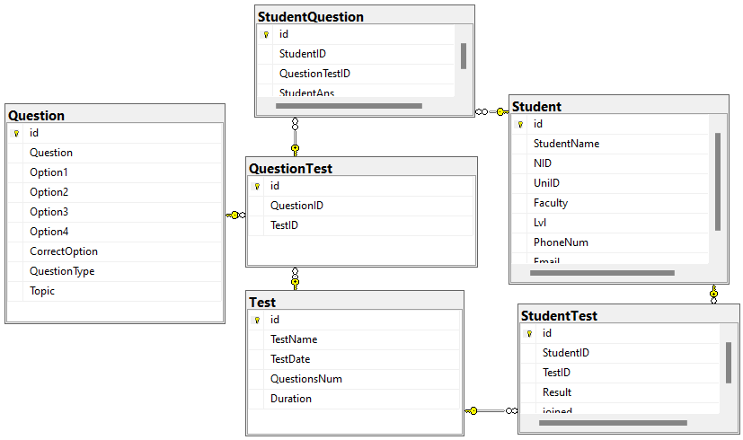

# Testing-System
Testing System using SQL language.
### project features :-
- The system allow admins to add tests to the students
- Every student can see the tests that he has to take
- Every student can know its degree after the end of each test

  
Diagram

   
